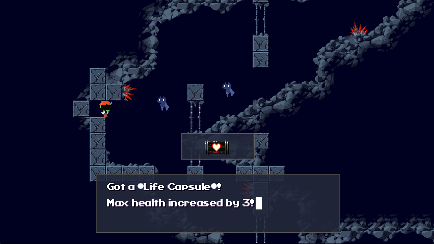
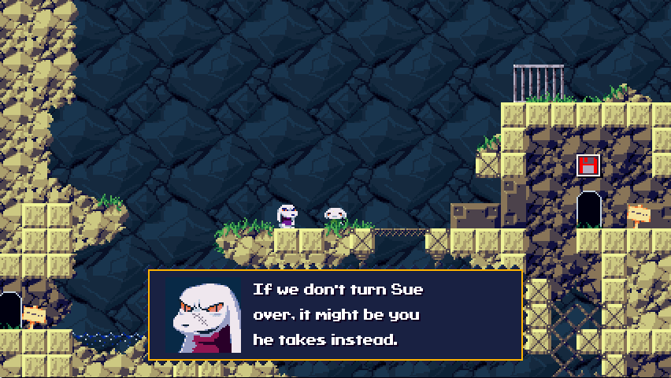
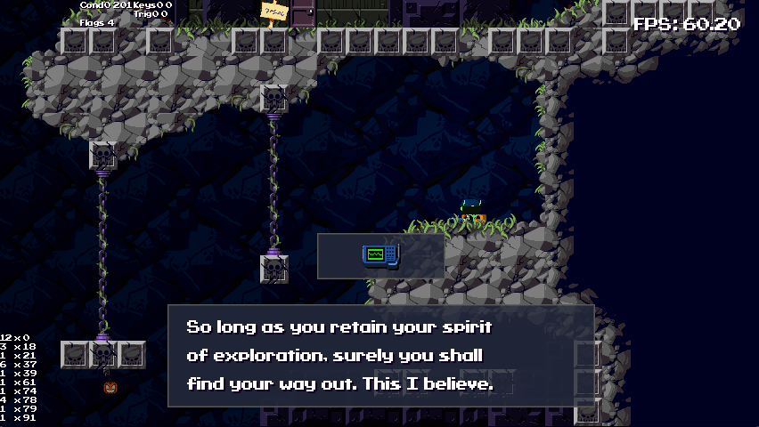
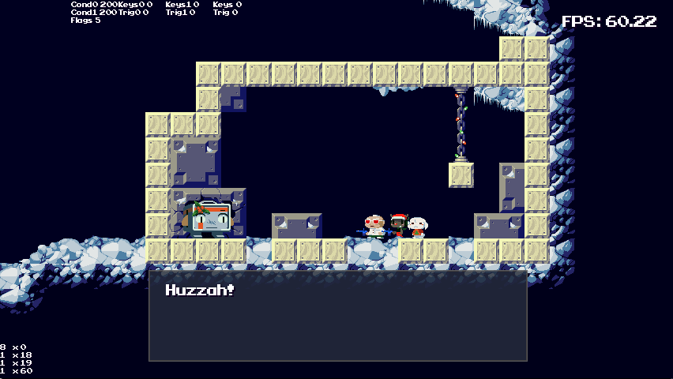

# AGTP-CS+
A basic [Cave Story+](https://store.steampowered.com/app/200900/Cave_Story/) Mod to bring over the fan-favorite [Aeon Genesis Translation Patch](https://aeongenesis.net/projects/cavestory)

## Features

- Classic fan translation of the beloved 2004 indie game, just as you remember it
- Full support for all Cave Story+ features, including achievements and animated facepics
- Compatible with tons of other mods (only uses TSC files, a select few stage table modifications, and two images)

## Installation Tutorial

1. [Click on this link to download the latest commit as a zip file](https://github.com/aarmastah/agtp-csplus/archive/refs/heads/main.zip)
2. Extract the zip file to **Documents/My Games/Cave Story+/Mods**
3. Create a file in **Documents/My Games/Cave Story+/Mods** called **mods.txt**
4. Add a new line to **mods.txt** that reads "**+ agtp-csplus-main**" (or the name of the extracted folder, with a plus symbol in front of it)
5. Launch Cave Story+. If you see "Studio Pixel presents" during the intro, the mod loaded successfully!

## Screenshots

